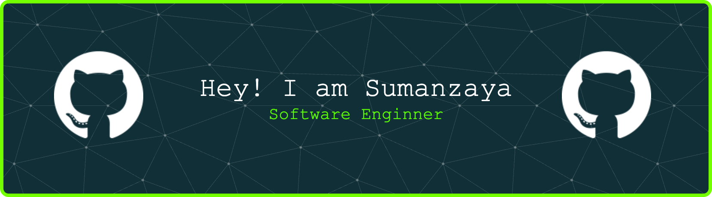

---

## 👨‍💻 About Me

I’m a **Software Engineer** who loves going **beyond abstractions**.

I mainly work with **React Native** and **Next.js**, but I’m especially interested in:
- how JavaScript talks to **Native Android or Ios**
- how apps communicate with **hardware & system APIs**
- how **Machine Learning** can solve real-world problems

I enjoy debugging things that *aren’t obvious* and understanding *why something works*, not just *how to use it*.

---

## 🛠 Tech Stack

                                     

### 📱 Mobile

---

### 🌐 Web

---

### 🤖 Machine Learning (Exploration)

- Data preprocessing & clustering
- Recommendation systems

---

## 🧪 Playground & Experiments

I actively experiment with:
- ⚙️ Native ↔ JS performance bottlenecks
- 🧠 ML-driven decision support systems

This repo is not just a portfolio — it’s a **learning log**.

---

## 📌 Engineering Philosophy

> **“Abstractions make you productive.  
Understanding what’s underneath makes you powerful.”**

I like systems that are:
- predictable
- debuggable
- and built with intention

---

## 🌐 Connect With Me

- 💼 **LinkedIn**:[Tri Sumanzaya](https://www.linkedin.com/in/trisumanzaya)  
- 🧑‍💻 **GitHub**: [Trisumanzaya93](https://github.com/Trisumanzaya93)

---

## 📊 GitHub Stats:
 
 

---
###

 

###
---

⭐️ If you enjoy digging under the hood,  
we’ll probably enjoy building things together.

